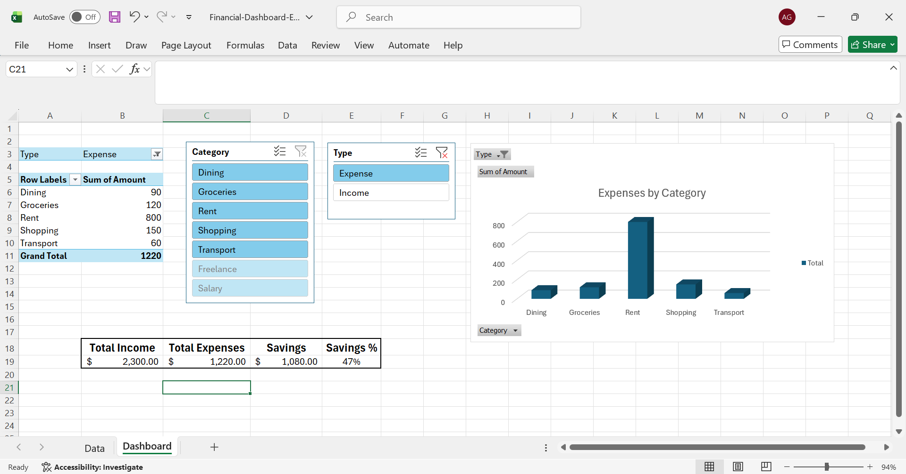

📊 Financial Performance Dashboard (Excel)

📌 Overview

This project is an interactive financial dashboard built using Microsoft Excel to analyze income, expenses, savings, and budget performance. The dashboard transforms raw financial data into meaningful insights using Pivot Tables, KPIs, slicers, and visual charts.

🎯 Objective

To analyze financial transactions and identify spending patterns, budget gaps, and savings performance through an interactive and visual dashboard.

📊 Key Features
KPI metrics: Total Income, Total Expenses, Savings, Savings %
Expense breakdown by category using Pivot Tables
Interactive slicers for dynamic filtering
Budget vs Actual variance tracking
Clean and structured dashboard design for better decision-making

🛠 Tools Used
Microsoft Excel
Pivot Tables
Pivot Charts
Slicers
Conditional Formatting
Data Visualization

📷 Dashboard Preview

Overview

Filtered View

📈 Key Insights
Rent is the highest expense category across all transactions
Discretionary spending (shopping and dining) shows occasional overspending
Savings remain positive after tracking income vs expenses
Dashboard enables quick identification of financial trends and budget performancevalues  
- `Dashboard` → Interactive dashboard with KPIs, charts, and slicers

💡 Business Value

This dashboard can help individuals or small businesses:
Control unnecessary spending
Track financial health in real-time
Make informed budgeting decisions
Identify cost-saving opportunities

 📁 Project Structure
Data Sheet → Raw financial transactions
Dashboard Sheet → KPIs, charts, and interactive visuals

👤Author
Sachi Goel
