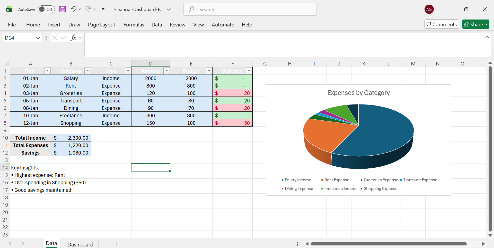

# Financial Performance Dashboard (Excel)

## Overview
This project is an interactive financial dashboard built using Microsoft Excel to track income, expenses, savings, and budget variance.

## Features
- KPI metrics (Income, Expenses, Savings, Savings %)
- Expense analysis by category
- Pivot tables and slicers for interactivity
- Conditional formatting for variance tracking

## Tools Used
- Microsoft Excel
- Pivot Tables
- Slicers
- Data Visualization
- Formulas (SUMIF, IF)

## Dashboard Preview

## Key Insights
- Rent is the highest expense category
- Identified overspending in shopping
- Maintained positive savings

## Author
Sachi Goel
